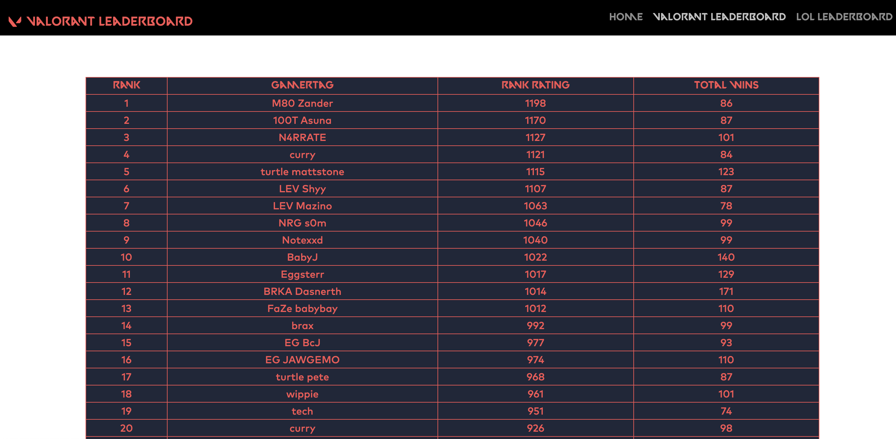
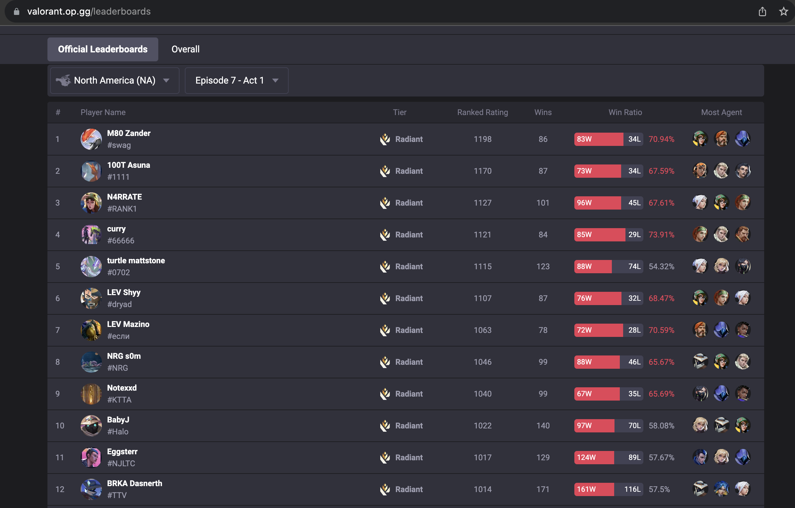
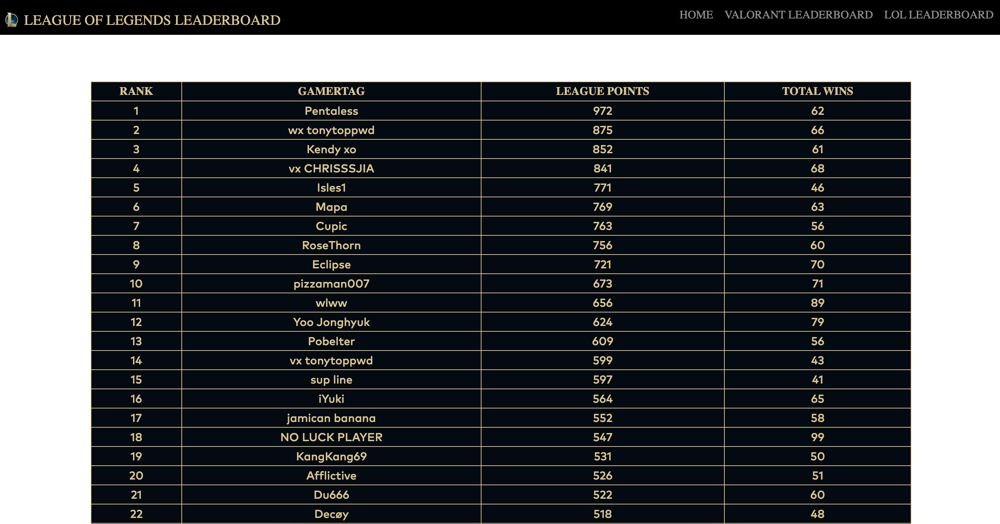
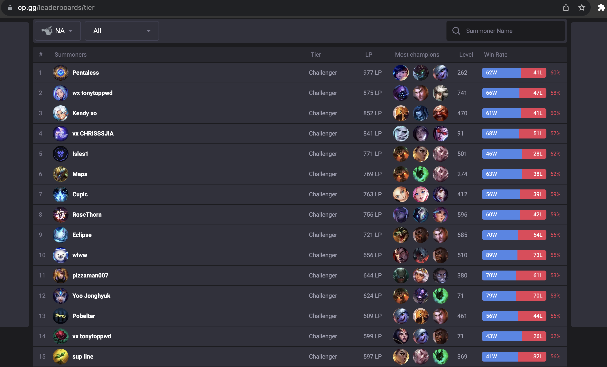

# Riot Games Leaderboard app (local)

Daniel Gregorio-Torres

11/22 - 12/22

Personal Project

## Description

RUNNING APP LOCALLY WITH `.env` FILE

The purpose of this small web app is to demonstrate some of the information that can be obtained using the https://developer.riotgames.com/ Free API. This application displays competitive play information for 2 games developed by Riot Games. One game includes Valorant, where the competitive/ ranked leaderboard is displayed with the rank, gamertag, rank rating, and total wins for the top 100 players is displayed. The other game is League of Legends, where the rank, gamertag, league points, and total wins for the top challenger(best rank) players is displayed.

## Navigation

- [Setup](#setup)
- [Installation](#installation)
- [Tests](#tests)
- [Previews](#previews)

## Setup

Create a `.env` file with the following contnets:

```.env
ACT_ID="<VALORANT ACT ID YOU WANT>"
API_KEY="<YOUR API KEY>"
```

For the ACT_ID you can use the following route to get the act id you would like to get information from. https://na.api.riotgames.com/val/status/v1/platform-data?api_key=<Your_API_KEY>

## Installation

###### Unix/ macOS:

```shell
python3 -m venv env
source env/bin/activate
pip3 install --upgrade -r requirements.txt
python3 app.py
```

###### Windows:

```shell
py -m venv env
.\env\Scripts\activate
pip install --upgrade -r requirements.txt
python3 app.py
```

## Tests

The application comes with the following tests:

1. Test for the home page route ('/')
1. Test for the 'valLeaders' route ('/valLeaders')
1. Test for the 'lolLeaders' route ('/lolLeaders')

In order to run the test the enter the following command:

```shell
pytest
```

## Previews

###### Valorant Leaderboard From App



###### Valorant Leaderboard From [op.gg](https://valorant.op.gg/leaderboards)



###### Valorant Leaderboard From App



###### Valorant Leaderboard From [op.gg](https://www.op.gg/leaderboards/tier)


